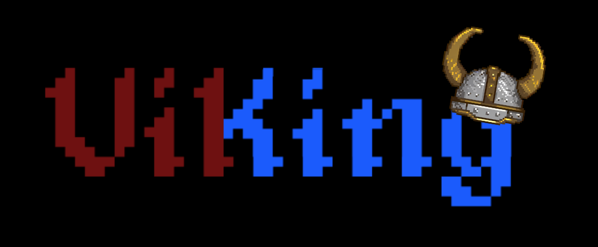
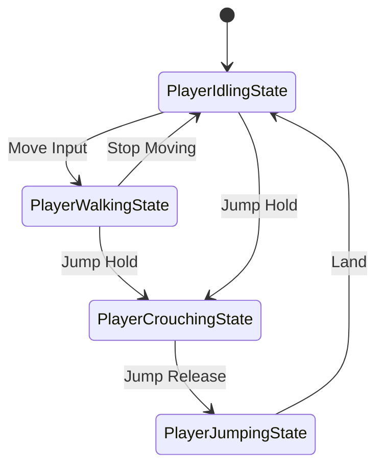
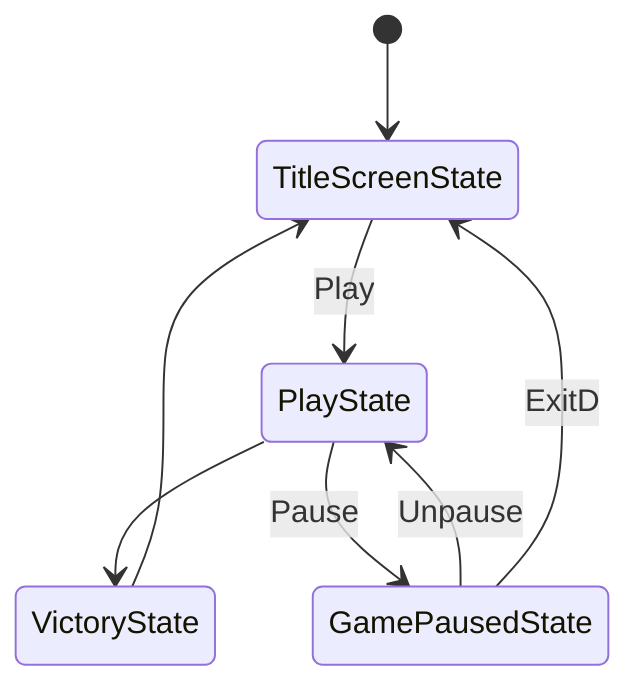
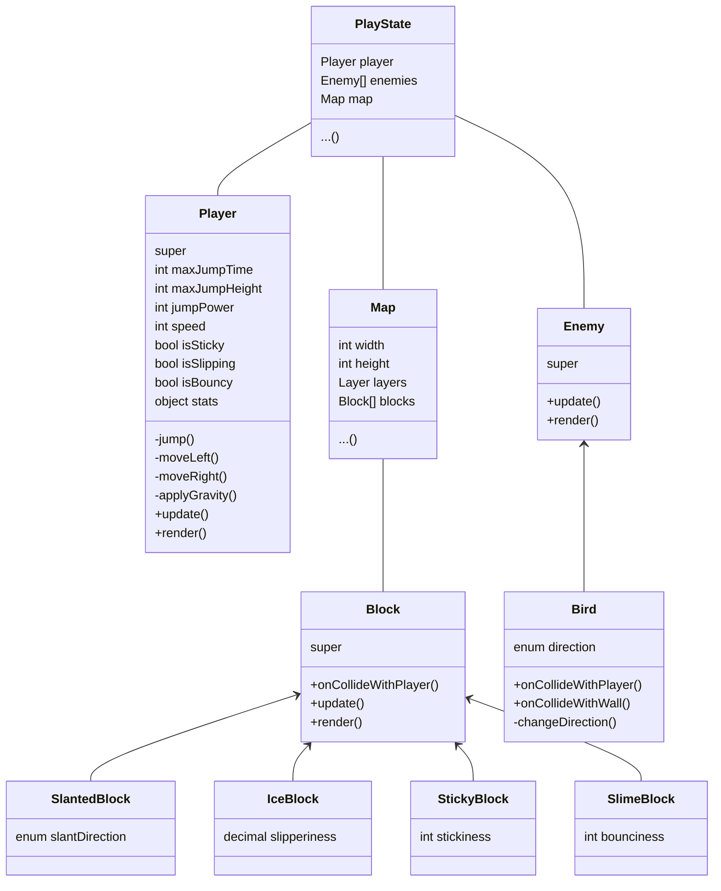
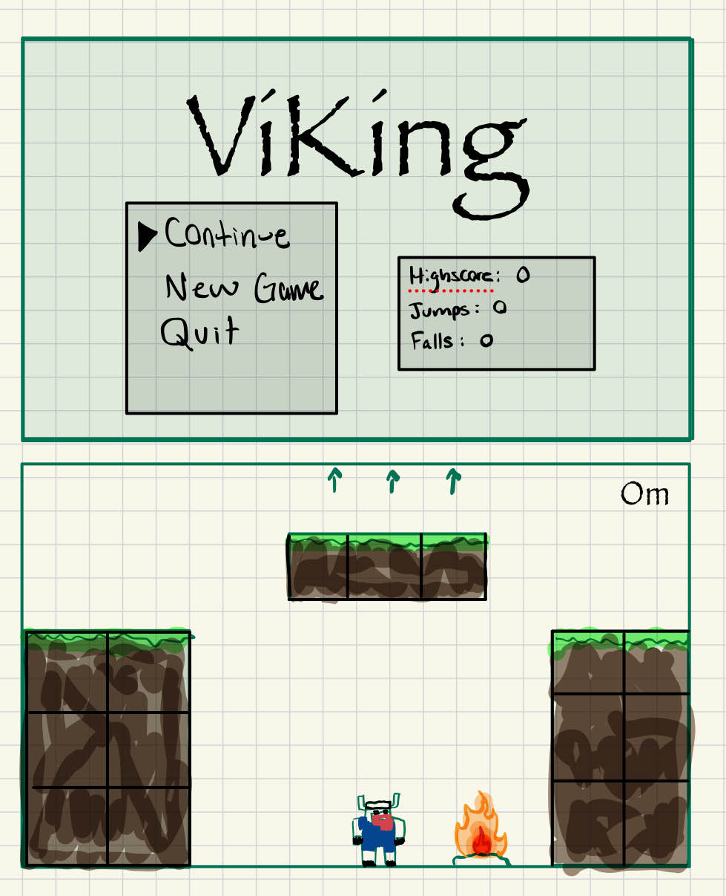
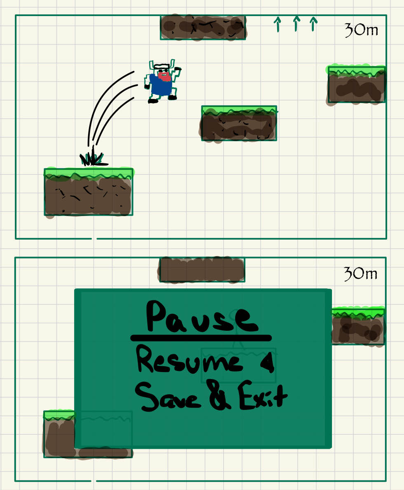
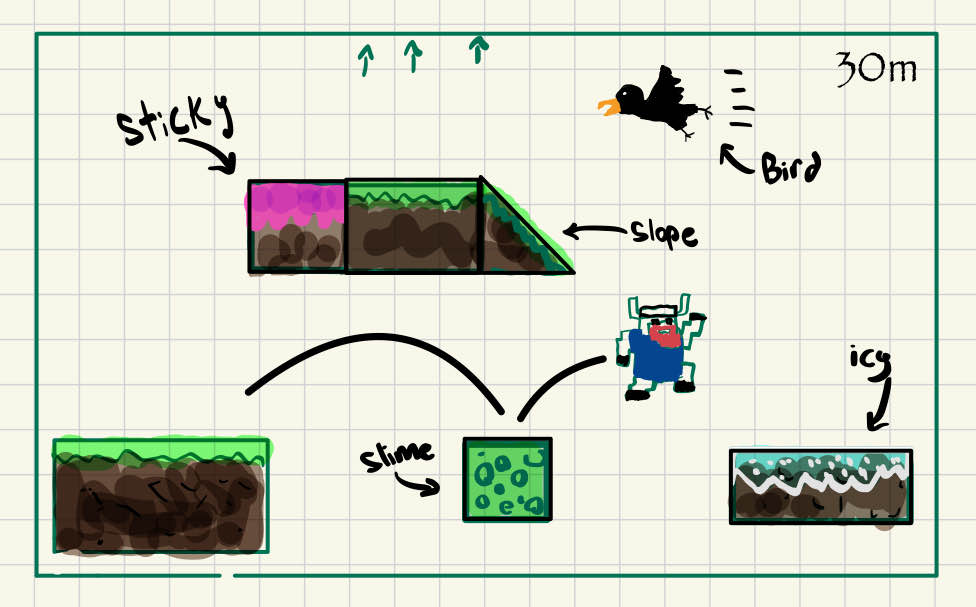
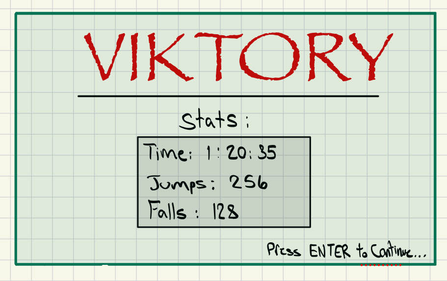

## ✒️ Description

In this platformer game, the player assumes the role of a Viking who's goal is to climb to the top of a structure to reach his lost booze. The map is a vertical scroller meaning that the Viking can only load the next level by getting high enough, these 'levels' are more so stages taht work together as one big map that continuously climbs upwards. There is no lose condition only the win condition of reaching the top of the structure, however beware, as falling will lead you to be heavily punished and fall down multiple stages at times. Take your time, or else you'll learn true frustration...

## 🕹️ Gameplay

Players will begin by being loaded into a new world trapped within two never ending walls on either side with their only way to get out is to go from platform to platform reaching as high as possible. There are only five keys that can be used to control your character in this game. A/LEFT ARROW will point your character to the left, D/RIGHT ARROW will point your character to the right and finally SPACE will cause your character to jump. All of these put together allows you to jump in two directions while being able to walk around slightly. The vertical and horizontal distance you can cover solely depends on how long your jump was charged for. Meaning the longer you hold SPACE the further you can reach. The mechanic that adds a challenge to this game is the fact that you must get a feel for how long you have held your jump for as there is no indication for this.

The Viking will only land on flat platforms, if hit a slanted structure prepare for a long fall. Furthermore, another key mechanic of the game is to be able to bounce off of walls, by doing so you can change your velocity midair, you'll need to use this at certain points throughout the levels. After reaching the top of your structure, that's it, you've won!

This is a recreation of the game *Jump King*, it is a single player game that is played with direction keys and SPACE for jumping.

## 📃 User Stories

### Core Gameplay
1. The user shall press the SPACE key to make the Viking jump.
2. The user shall hold the SPACE key to charge the jump for greater distance.
3. The user shall press A/LEFT ARROW to make the Viking face left.
4. The user shall press D/RIGHT ARROW to make the Viking face right.
5. The system shall calculate the vertical and horizontal distance based on the direction arrows and duration that the SPACE key is held.

### Navigation and Progression
6. The system shall load the next stage when the Viking reaches a specific height.
7. The system shall allow the Viking to fall to previous stages when they miss a platform.
8. The system shall display a starting screen for the user to begin the game.
9. The system shall display a victory screen when the user reaches the top of the structure.

### Obstacles
10. The user can encounter icy platforms that reduce the Viking's friction and make stopping difficult.
11. The user can encounter sticky platforms that slow down the Viking's movement.
12. The user can encounter slime platforms that make the Viking bounce upon landing.
13. The user can encounter sloped platforms that cause the Viking to slide.
14. The user can encounter birds that the Viking can collide with.
15. The system shall introduce wind mechanics that push the Viking horizontally mid-jump.

### Environmental Interactions
16. The system shall render walls on both sides of the screen to trap the Viking within the game area.
17. The user should collide with tiles/platform from the side.
18. The user should stop falling when landing on a tile/platform (except slope and slime)

### UI/UX
19. The system shall include a pause screen that the user can access during gameplay.
20. The system shall display the Viking's height as a progress indicator on the side of the screen.
21. The system shall include a button to return to the main menu from the pause screen.
22. The system shall play a celebratory sound effect upon reaching the victory screen.

### Persistance
23. The system shall track the highest point reached by the Viking as a user record.
24. The system shall track the players last idle state position values to save.
25. The system shall load the players previous idle state and highscore upon opening the game.
26. The system shall remove the players save once they complete the game.

## 🤖 State Diagram
Player States:

Game States:

## 🗺️ Class Diagram

## 🧵 Wireframes

Keep in mind, the color theme WILL be different.

-   _Continue_ will load the game starting from the persisted data (player's last position).
-   _New Game_ will start the player in the first level/layer and ovewrite the persisted player position.
-   _Quit_ Will shut down the game.

-   _Resume_ will close the pause menu.
-   _Save & Exit_ will return to the Main menu screen.

-   _Press ENTER..._ will return to the Main menu screen.

## 🎨 Assets

#### 🖼️ Images

All images were taken from [itch.io](https://itch.io/).
-   [Viking Character](https://chierit.itch.io/elementals-crystal-mauler)
-   [Bird Sprites](https://smithygames.itch.io/crow-sprite)
-   [Background1](https://edermunizz.itch.io/free-pixel-art-forest)
-   [Block Sprites and Background2](https://szadiart.itch.io/pixel-fantasy-caves)
-   [Background3](https://vnitti.itch.io/glacial-mountains-parallax-background)
-   [BlockTextures](https://piiixl.itch.io/textures)

#### ✏️ Fonts

For the Nordic aesthetic, we're using the Alagard font, a nice pixelated and fantasy-esque font. For other things, we'll use Dogica, used to display general info/settings and will still keep the retro look.

-   [Alagard](https://www.dafont.com/alagard.font)
-   [Dogica](https://www.dafont.com/dogica.font)

#### 🔊 Sounds

Sounds are taken from multiple sources, like [freesound.org](https://freesound.org) and [itch.io](https://itch.io/game-assets), and [sfxr](https://sfxr.me/) for the music and sound effects.

-   [8-Bit Fantasy & Adventure](https://xdeviruchi.itch.io/8-bit-fantasy-adventure-music-pack)
-   [Jumping sound](https://freesound.org/people/D-Ryro/sounds/674341/)
-   [Landing Sound](https://freesound.org/people/egomassive/sounds/536766/)
-   [Menu Blip](https://sfxr.me/#11111DUVhUuSiDfjSq2sQyjxdzgkUwr9cfuGLPmXWMu6xNjoALBJCYwFQEGu66mtro7Y7jhdsWR6fiAJ61nieRAVuJR88zVfCDUCsNveeaxBW2gcYuQTEfKD)
-   [Slime Bounce](https://sfxr.me/#34T6PkkEwDrZjLx4omzJbBXPJCUPDJejd3qCyDTVkSQFk4T8yWWcbQe9Jpb3jYpisrSpPXpEBvaBpuuR5eB6j5CUPcMsWHyXDKwLy8JZmstSWnedbYWtqEab1)
-   [Crow](https://www.youtube.com/watch?v=kA8mEHxkUsw)

### 📚 References

-   [Jump King Game](https://www.jump-king.com/)
